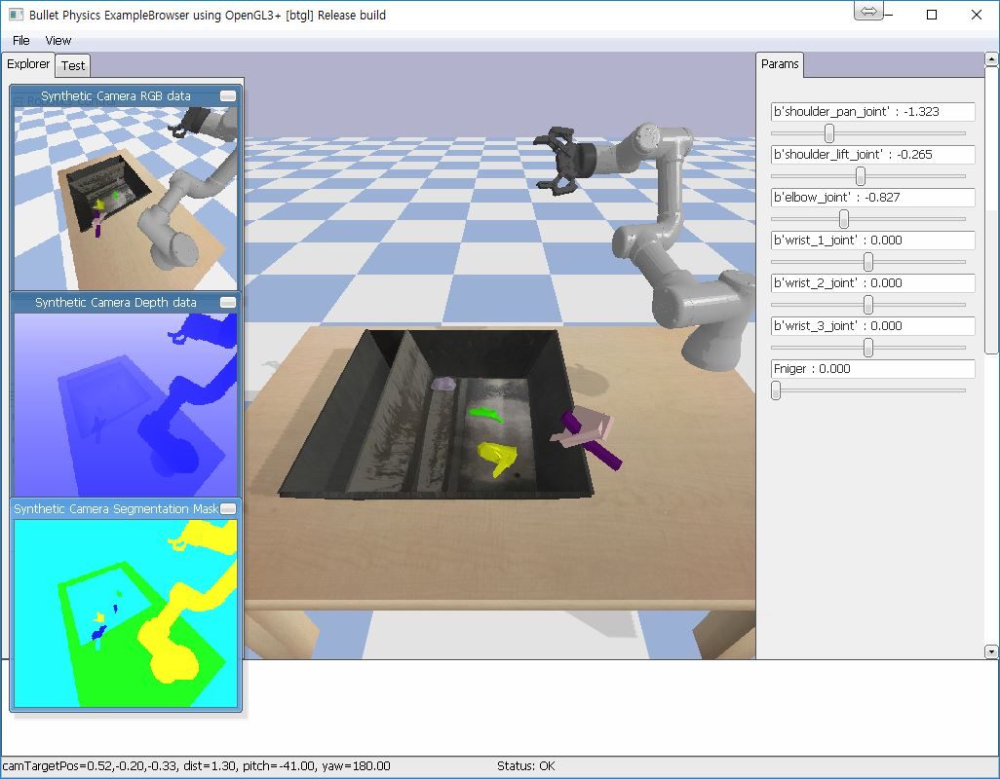

# PybulletIncorlUR3

## Additional resource
- Download & Unzip to random_urdfs/. (https://sites.google.com/site/brainrobotdata/home/models)

## Dependency
- Python 3.5.4
- Pybullet (https://pybullet.org/wordpress/)
- Open AI Gym (https://gym.openai.com/)
- OpenCV-Python
- ...

## Example
